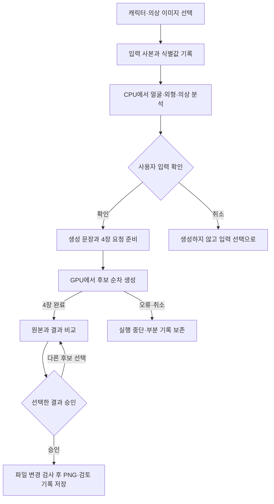

# 입력 이미지가 승인된 결과로 저장되기까지

2026-10-04 현재 작업실 구현을 설명합니다. 이 문서는 사용자 시나리오와 실제 코드를 연결하며, 새로운 제품 정책을 정하지 않습니다. 먼저 과정과 정보의 변화를 설명하고, 각 절 끝에 구현 위치를 적었습니다.

## 한 요청의 시작과 끝

사용자가 바꾸려는 것은 의상입니다. 이를 위해 프로그램에는 캐릭터의 외형과 새 의상의 특징이 따로 전달돼야 합니다. 원본 두 장을 그대로 한 덩어리로 취급하면 기존 의상이나 의상 사진 속 인물의 특징이 섞일 수 있습니다.

현재 이 경로에는 외부 자세 이미지가 들어가지 않습니다. 캐릭터에서 골격을 검출하더라도 얼굴을 자르거나 체형을 분석하는 데 쓰는 정보이며, 새 자세를 지정하는 제어 이미지로 전달하지 않습니다.

## 1. 입력: 이번 요청에서 사용할 두 이미지를 고정한다

사용자가 캐릭터와 의상 파일을 선택하고 생성 버튼을 누르면 새 실행 폴더를 만듭니다. 필요한 로컬 모델이 있는지 확인한 다음 원본 파일 내용을 읽어 식별값과 분석용 사본을 남깁니다. 이 식별값으로 나중에 어떤 입력으로 만들었는지 추적할 수 있습니다.

투명 픽셀이 있는 입력은 분석용 사본에서만 흰 배경에 합성합니다. 원본 파일은 바꾸지 않습니다. 불투명 입력은 기존 변환 방식을 유지합니다. 투명 부분이 분석 과정에서 검게 보이는 현상과 원본 캐릭터의 색을 구분하기 위한 처리입니다.

**전달되는 정보:** 캐릭터 사본, 의상 사본, 원본 경로·식별값, 전처리 여부.

구현: [작업 시작](../genai_lab/studio_controller.py)의 `start`, [입력 준비](../genai_lab/studio_generation.py)의 `analyze_inputs`, `save_analysis_reference`.

## 2. 검증·분석: 생성에 필요한 정보를 만들 수 있는지 확인한다

분석은 CPU 하위 프로세스에서 수행합니다. 캐릭터 관절을 검출하고 얼굴·머리 영역을 준비한 뒤, 이미지 태거로 캐릭터 외형과 의상 설명 후보를 각각 얻습니다. 태거는 이미지에 맞을 가능성이 있는 단어와 점수를 내는 도구입니다. 그 결과를 사용자 확인 없이 정답으로 확정하지 않습니다.

얼굴 크롭은 얼굴·머리를 남기고 팔·어깨·몸통이 참조로 따라오지 않도록 하는 입력 처리입니다. 캐릭터가 여러 명이거나, 채택한 크롭 규칙이 거부하거나, 외형·의상 설명을 준비하지 못하면 오류를 표시합니다. 실패한 분석을 다른 캐릭터의 정보로 조용히 대체하지 않습니다.

**전달되는 정보:** 생성에 쓸 얼굴 이미지, 외형·체형·고정 특징 설명, 의상 설명 후보, 체형 측정 결과, 분석 기록.

구현: [CPU 분석](../genai_lab/studio_analysis.py), [얼굴 크롭·캐릭터 규칙](../genai_lab/onepass_character.py), [의상 태거](../genai_lab/clothing_analysis.py).

## 3. 사용자 확인: 분석 후보를 생성 조건으로 확정한다

확인창에서는 원본 캐릭터·얼굴 크롭·의상을 비교합니다. 성별은 사용자가 선택한 값으로 정하고 태거의 추측으로 대신하지 않습니다. 의상 설명을 확인하고 필요한 경우 수정할 수 있습니다. 꼬리 외형 문구는 선택 사항이며, 입력한 뒤 사용자가 확인해야 적용됩니다. 문구를 다시 편집하면 확인이 해제됩니다.

예를 들어 꼬리 종 이름이 색을 잘못 유도한다면 사용자가 색과 무늬를 구체적으로 확인할 수 있습니다. 확인된 문구는 해당 꼬리 태그를 교체합니다. 확인하지 않은 초안은 기록과 실제 생성 조건을 구분하며 생성 문장에 넣지 않습니다. 귀 문구의 교체는 현재 기본 설정에서 꺼져 있습니다.

이 단계의 어휘 검사는 성별·체형·노출 등의 등록된 태그를 검사하는 기능입니다. 자유로운 자연어의 모든 의미를 알아내는 안전 분류기가 아닙니다.

**전달되는 정보:** 확인한 성별, 의상 설명, 선택적으로 확인한 꼬리 문구. 사용자가 취소하면 생성 횟수는 0입니다.

구현: [입력 확인창](../genai_lab/studio_controller.py)의 `confirm_inputs`, [문구 검사](../genai_lab/reference_tag_policy.py), [성별 처리](../genai_lab/onepass_gender.py).

## 4. 처리: 확인된 정보로 4장의 생성 요청을 만든다

얼굴 이미지가 확인 이후 바뀌지 않았는지 검사하고, 성별·의상·캐릭터 특징으로 긍정·부정 문장을 만듭니다. 긴 문장은 텍스트 인코더가 처리할 길이로 나누는 계획을 함께 만듭니다. 얼굴 이미지, 문장, 실행 설정, 서로 다른 4개의 seed를 하나의 요청으로 전달합니다. seed는 생성의 난수 시작값입니다.

현재 기본값은 이미지 736×1232픽셀, 후보당 28단계입니다. 작업실은 자세 조건을 전달하지 않고, 얼굴 참조는 앞 11단계에 꺼 두었다가 이후 17단계에 적용합니다. 이 값은 설정이지 품질 보장 기준이 아닙니다.

생성은 4장을 순서대로 수행합니다. 한 장이 실패하거나 취소되면 요청을 중단하며 두 번째 후보를 자동 재시도로 만들어 실패를 감추지 않습니다. 중간에 저장된 원시 이미지와 오류 기록은 남을 수 있지만, 완료된 4장 묶음으로 검토창에 넘기지 않습니다.

구현: [요청 조립](../genai_lab/studio_generation.py)의 `build_request`, [문장 조립](../genai_lab/onepass_prompt.py), [생성 실행](../genai_lab/onepass_generation.py)의 `generate_onepass_request`.

## 5. 결과 확인: 실행 성공과 사용자 승인을 분리한다

4장 생성이 끝나면 사용자가 원본과 비교해 하나를 선택합니다. 캐릭터가 같은지, 의상이 맞는지, 원치 않는 노출이 없는지 확인하고, 꼬리·귀가 감지된 경우에는 개수·종류·색도 확인합니다. 이는 자동 품질 점수가 아니라 사용자의 검토입니다.

화면에서 확인 버튼을 눌렀다는 이유만으로 저장하지는 않습니다. 생성 기록이 완료·유효 상태인지, 현재 파일이 기록된 이미지와 같은지도 검사합니다. 다른 후보로 이동하면 이전 승인을 지워서, 첫 번째 이미지를 승인한 상태로 두 번째 이미지를 저장하지 못하게 합니다.

구현: [결과 확인창](../genai_lab/studio_controller.py)의 `confirm_result`, [승인 상태 관리](../genai_lab/studio_generation.py)의 `StudioResults`.

## 6. 저장: 선택한 이미지와 승인 기록을 연결한다

저장 직전에 승인한 이미지와 현재 파일의 내용을 다시 비교합니다. 저장 위치에 같은 이름의 이미지나 검토 파일이 있으면 덮어쓰지 않습니다. 저장 중 오류가 나면 이번 저장에서 새로 만든 파일만 정리합니다.

사용자가 받는 것은 PNG와 같은 이름의 `.review.json` 파일입니다. 검토 파일에는 원본 실행 기록의 위치, 이미지 식별값, 사용자 승인 기록의 위치가 들어갑니다. 항목별 확인 내용은 실행 폴더의 `user-review.json`에 남습니다. 모델 실행 기록을 사용자 승인 기록으로 덮어쓰지 않습니다.

| 기록 | 담는 내용 | 용도 |
|---|---|---|
| `inputs/references.json` | 입력 원본의 식별값·분석 사본 처리 | 사용한 입력 확인 |
| `inputs/analysis.json` | 추출한 설명·얼굴 식별값·측정값 | 분석 결과 추적 |
| `inputs/approval.json` | 사용자가 확인한 조건·실제 적용한 문구 | 분석과 승인 사이의 변경 확인 |
| `generation/request.json` | 4개 seed·완료한 seed·요청 상태 | 중단 위치 확인 |
| `generation/seed-…/run.json`, `raw.png` | 후보별 생성 조건·실행 결과·이미지 | 모델 실행 재현·비교 |
| `generation/user-review.json` | 선택 후보·사용자 확인·승인·저장 상태 | 어떤 이미지를 승인했는지 확인 |

기록은 `outputs/studio-runs/<실행 식별자>/` 아래에 모입니다. 경로의 변수 이름을 이해해야 제품을 쓸 수 있는 것은 아닙니다. 이 목록은 개발자가 문제가 생긴 단계를 찾기 위한 안내입니다.

## 실패할 때 사용자가 보게 되는 결과

| 상황 | 프로그램 처리 | 다시 할 수 있는 일 |
|---|---|---|
| 모델·분석 환경이 준비되지 않음 | 생성 전에 오류 표시 | 실행 환경 확인 |
| 캐릭터 얼굴·의상을 준비하지 못함 | 분석 단계에서 중단 | 다른 입력 선택 |
| 입력 확인창을 취소함 | 이미지 생성하지 않음 | 입력 다시 선택 |
| 생성 중 실패·취소 | 부분 기록 보존, 완성 결과로 표시하지 않음 | 오류 확인 후 새 요청 |
| 결과 후보 변경 | 이전 승인 해제 | 새 후보 검토 |
| 승인 이후 이미지가 변경됨 | 승인·내보내기 거부 | 이미지 상태 다시 확인 |
| 저장할 이름이 이미 있음 | 기존 파일 보존 | 새 이름으로 저장 |

[작업실 회귀 테스트](../tests/test_studio_generation.py)는 실제 버튼 신호와 가짜 생성기를 이용해 이 연결을 검사합니다. 실제 GPU 생성 품질과 수행 시간은 별도 검증 대상입니다.

## 별도로 실행하는 자세 편집

저장 이미지의 자세 편집은 `완성 이미지 선택 → 준비된 골격 PNG 선택 → 보존할 항목 확인 → 별도 Qwen 프로세스 실행 → 결과 검토` 흐름입니다. 기본 이미지 생성 뒤 자동으로 이어지지 않습니다. 현재 GUI에서 자세 사진을 받아 자동으로 골격을 확인하는 전체 과정까지 연결된 것으로 설명하지 않습니다.

구현: [Qwen 편집 화면](../genai_lab/qwen_pose_gui.py), [실행 관리](../genai_lab/qwen_pose_edit.py), [별도 실행기](../genai_lab/qwen_pose_worker.py). 현재 생성·분석과 동시에 GPU를 점유하지 않도록 실행 순서를 확인합니다.
